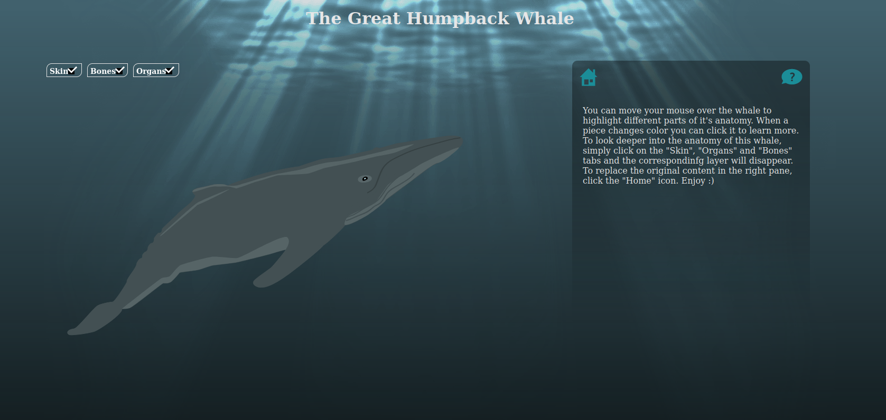
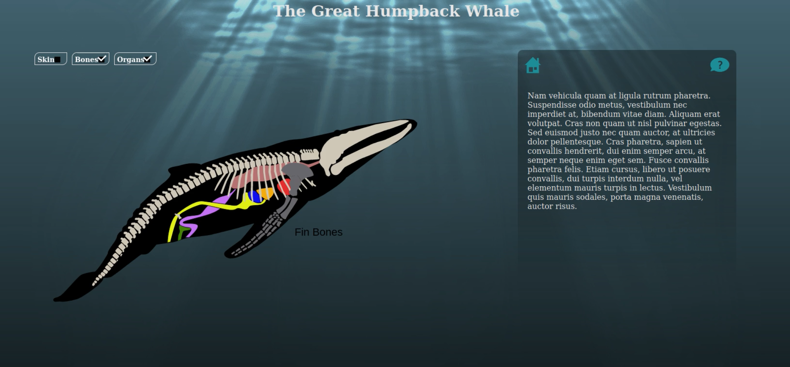

# Whale

## Overview

An Interactive project to teach users more about humpback whales. Users can toggle different layers to look inside the whale and hover over different parts to learn more about them. This project makes use of the [Raphael Javascript Library](https://dmitrybaranovskiy.github.io/raphael/) to make working with vector graphics a little easier.

## Code and Graphics

The whale project is written in JavaScript and HTML/CSS. The images and icons here were created in Illustrator and imported as HTML SVG elements animated with JavaScript.

